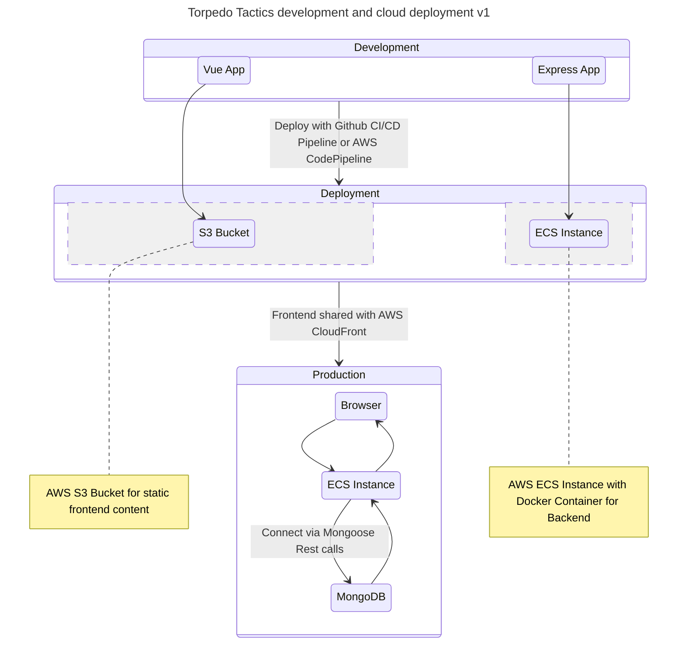

```mermaid
---
title: Torpedo Tactics development and cloud deployment v1
---
stateDiagram-v2    
    state Development {
        Frontend: Vue App
        Backend: Express App
    }

    Frontend --> App
    Backend --> Server

    state Deployment {        
        App: S3 Bucket
        note right of App
            AWS S3 Bucket for static frontend content
        end note

        Server: ECS Instance
        note right of Server
            AWS ECS Instance with Docker Container for Backend
        end note
    
        App -- Server: 
    }

    state Production {
        Client: Browser
        Server2: ECS Instance
        Database: MongoDB
        
        Client --> Server2
        Server2 --> Client
        Server2 --> Database: Connect via Mongoose Rest calls
        Database --> Server2
    }

    Development --> Deployment : Deploy with Github CI/CD Pipeline or AWS CodePipeline
    Deployment --> Production : Frontend shared with AWS CloudFront   

```